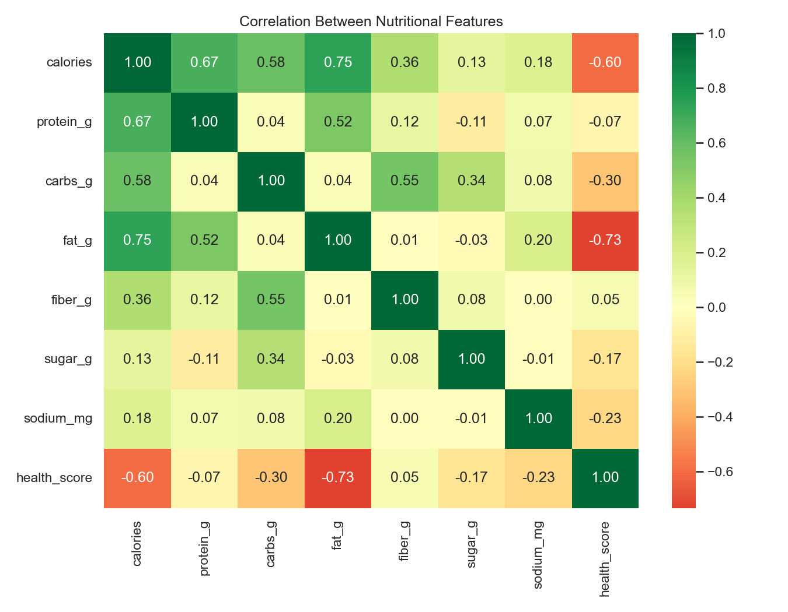
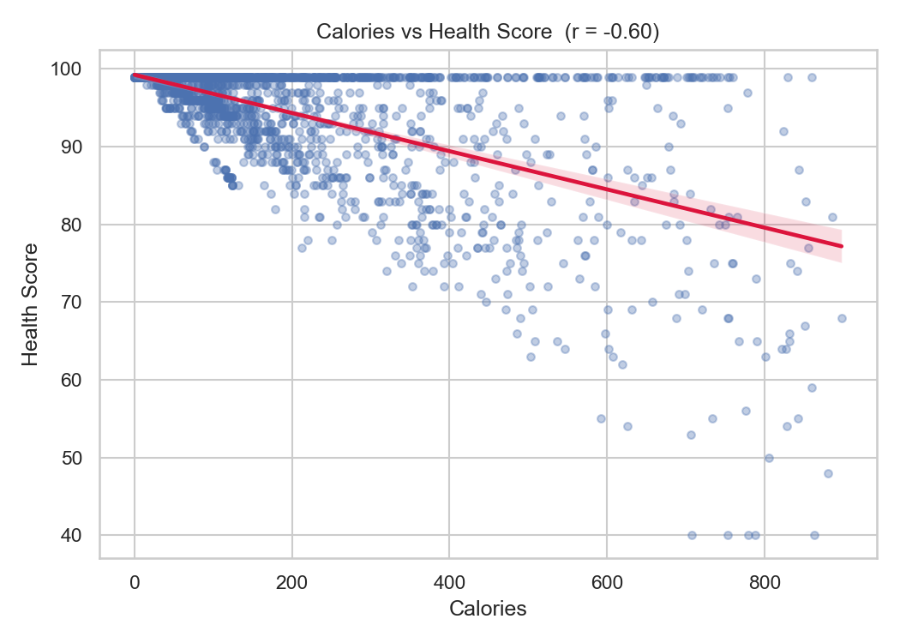
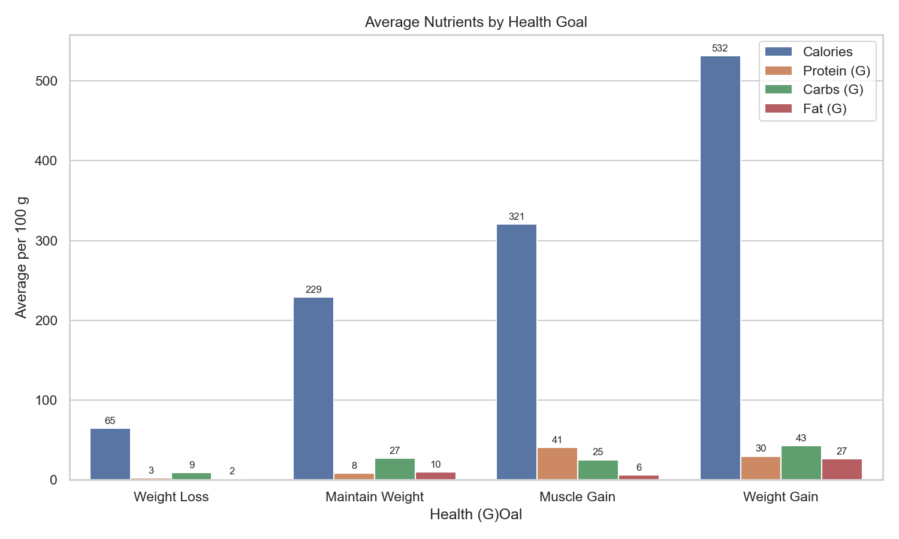
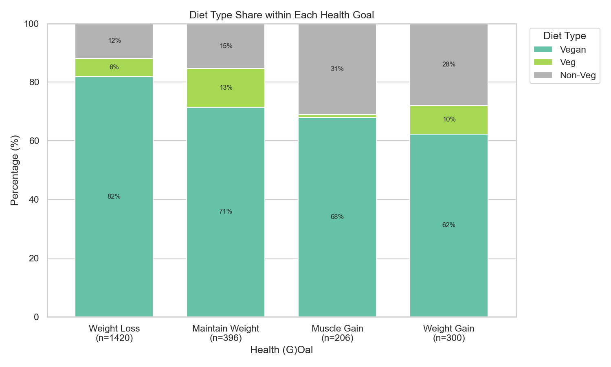
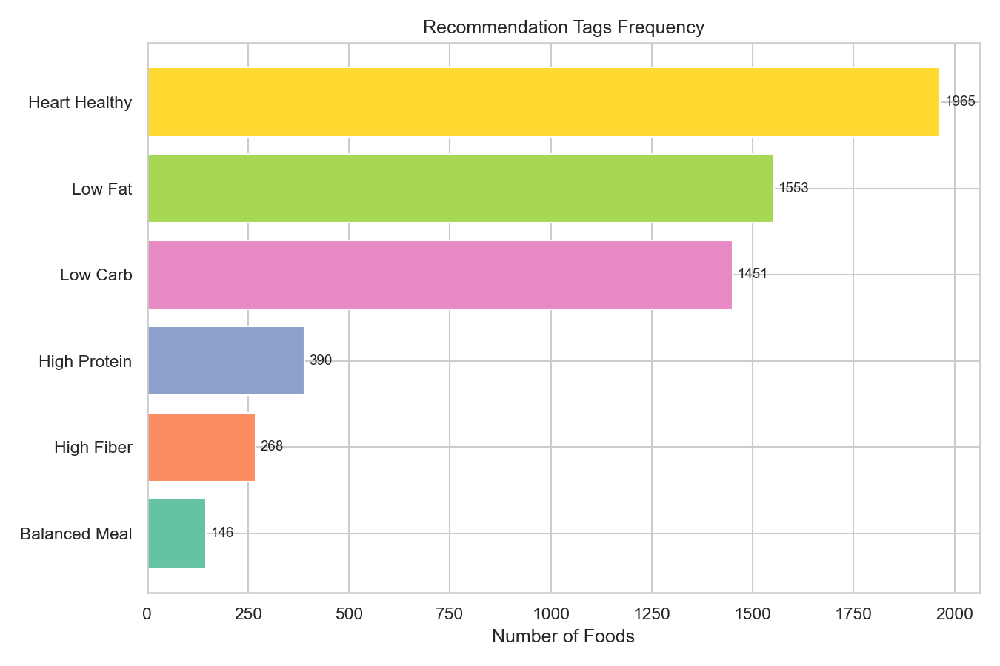
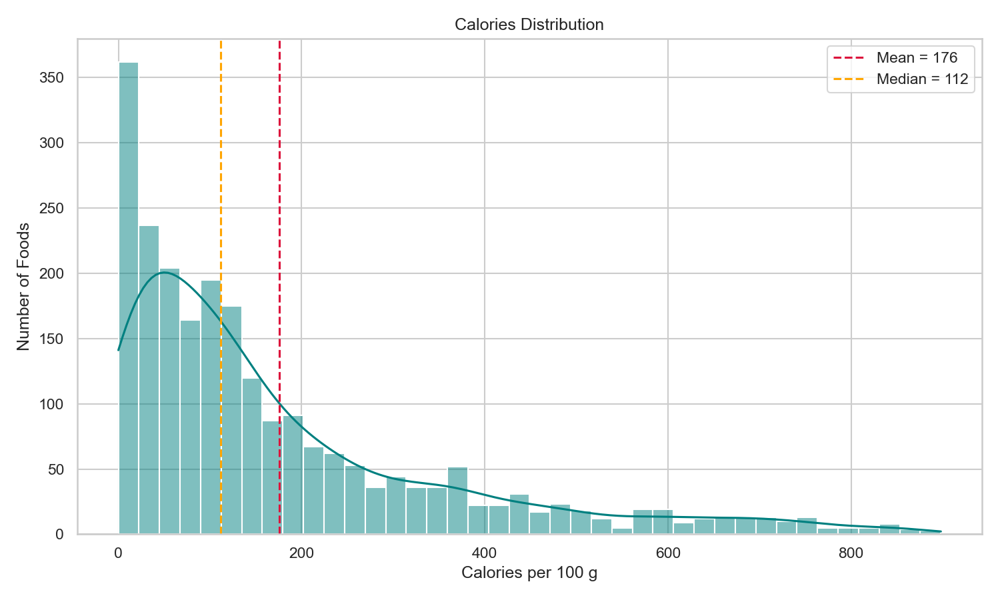

<div align="center">

# 🥗 Nutreva AI
### AI-Powered Nutrition Recommendation System

An intelligent **Content-Based Food Recommendation System** built using **Python**, **Machine Learning**, **TF-IDF**, **Cosine Similarity**, and **Streamlit**.

---


</div>

---

## 🔗 Live Demo

**[Try Nutreva AI live →](https://nutreva-ai-q5x6uoynp3s72buwdk4jps.streamlit.app/)**

---

# 📌 Project Overview

Nutreva AI is an intelligent nutrition recommendation system that suggests healthy foods based on user preferences.

Instead of using collaborative filtering, Nutreva uses a **Content-Based Recommendation Engine** powered by **TF-IDF** and **Cosine Similarity** to recommend foods that best match a user's profile.

Users can select:

- 🎯 Health Goal
- 🍽 Meal Type
- 🥦 Diet Type
- 🌍 Cuisine

The AI engine analyzes these preferences and recommends the most relevant foods from the dataset.

---

# ✨ Features

- 🤖 AI Powered Recommendation Engine
- 🥗 Content-Based Filtering
- 📊 TF-IDF Vectorization
- 📈 Cosine Similarity Matching
- 🎯 Smart Profile-Based Recommendations
- 🌍 Cuisine Filtering
- 🥦 Diet Type Filtering
- 🍽 Meal Type Filtering
- ❤️ Health Goal Matching
- 📊 Nutrition Dashboard
- 📉 Interactive Charts
- 🔍 Exploratory Data Analysis with 23 visualizations
- 🌙 Professional Streamlit UI

---

# 🧠 AI Workflow

```text
User Preferences
        │
        ▼
Data Preprocessing
        │
        ▼
Combined Features
        │
        ▼
TF-IDF Vectorization
        │
        ▼
Cosine Similarity
        │
        ▼
Smart Filtering
        │
        ▼
Top AI Recommendations
```

---

# 🛠️ Tech Stack

| Technology | Purpose |
|------------|---------|
| Python | Programming Language |
| Pandas | Data Processing |
| Scikit-Learn | Machine Learning |
| TF-IDF | Feature Extraction |
| Cosine Similarity | Recommendation Engine |
| Streamlit | Web Application |
| Plotly | Interactive Charts |
| Matplotlib & Seaborn | Exploratory Data Analysis |

---

# 📂 Project Structure

```text
Nutreva
│
├── app.py
├── README.md
├── requirements.txt
│
├── dataset
│   └── Nutreva.csv
│
├── analysis
│   ├── eda.py
│   └── graphs/          # 23 generated visualizations
│
├── models
│   ├── preprocess.py
│   ├── recommender.py
│   └── similarity.py
│
├── utils
│   ├── styles.py
│   ├── cards.py
│   ├── charts.py
│   └── helper.py
│
├── pages
│   ├── About.py
│   ├── Home.py
│   └── Recommendation.py
│
└── assets
```

---

# ⚙️ Installation

Clone the repository

```bash
git clone https://github.com/Javeria-05/Nutreva-AI.git
```

Move into project folder

```bash
cd Nutreva-AI
```

Install dependencies

```bash
pip install -r requirements.txt
```

Run Streamlit

```bash
python -m streamlit run app.py
```

---

# 🚀 How It Works

1. Load Dataset
2. Clean & Preprocess Data
3. Create Combined Features
4. TF-IDF Vectorization
5. Cosine Similarity Calculation
6. Smart User Profile Filtering
7. AI Recommendation Generation
8. Display Results in Streamlit Dashboard

---

# 📊 Dataset Information

- 🍽 Foods: **2396**
- 📋 Features: **20**
- 🤖 Recommendation Type: **Content-Based Filtering**
- 📈 AI Model: **TF-IDF + Cosine Similarity**

---

# 🔍 Exploratory Data Analysis

A full EDA was performed on the dataset to understand the relationships between nutritional values, health goals, diet types and recommendation tags.

**Data cleaning:** 74 invalid rows were removed before analysis (foods above 900 kcal per 100 g, which is physically impossible, and one corrupted row), leaving **2322 foods**.

Generate all 23 graphs:

```bash
python analysis/eda.py
```

### Correlation Between Nutritional Features


### Calories vs Health Score


### Average Nutrients by Health Goal


### Diet Type Share within Each Health Goal


### Recommendation Tags Frequency


### Calories Distribution


### Key Findings

- **Calories and Health Score** have a strong negative correlation (r = −0.60): higher-calorie foods receive lower health scores.
- **Fat** is the second biggest factor lowering the health score (r = −0.51).
- **Protein and Fat** are strongly linked (r = 0.69), mainly driven by meat-based foods.
- **Weight Gain** foods have the highest average calories, protein and fat, while **Weight Loss** foods are the lowest across all macronutrients.
- The calories distribution is **right-skewed**: most foods are low-calorie, while a small number of high-calorie foods pull the mean above the median.
- **Weight Loss** foods make up the largest share of the dataset, and **Heart Healthy** is the most common recommendation tag.

All 23 graphs are available in [`analysis/graphs`](analysis/graphs).

---

# 📸 Screenshots


---

# 🚀 Future Improvements

- Food Images
- Nutrition Tracking
- User Login
- Meal Planner
- Favorite Foods
- AI Chatbot
- Barcode Scanner
- Mobile App Version

---

# 👩‍💻 Developer

**Javeria**

Software Engineering Student

AI & Machine Learning Enthusiast

---

# ⭐ Support

If you like this project, don't forget to ⭐ star this repository.